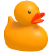

# Unity Icon Generator

A simple Unity tool for generating PNG icons directly from a camera view.

Created by **Tomi Illes**

https://tamas-illes.com

This project contains a lightweight utility script that renders a camera view to a texture and saves it as a `.png` file.

It can be used for:

- inventory icons
- item icons
- UI thumbnails
- asset previews

Repository:  
https://github.com/T0M13/Unity_Icon_Generator

---

## Preview

Example icon generated with the tool:



---

## Features

- Generate PNG icons directly from a camera
- Custom output folder
- Custom file name
- Custom resolution
- Optional fallback to the GameObject name if no file name is entered
- Works in the Unity Editor
- No need to start the scene or enter Play Mode
- Simple setup and quick export

---

## Project Structure

```text
Assets
│
├─ Project
│  ├─ Edited_Icons
│  │   Example edited icons
│  │
│  └─ Generated_Icons
│      Icons generated by the script
│
├─ Scenes
│  └─ Icon_Generation_Scene.unity
│
├─ Scripts
│  └─ IconGenerator.cs
│
├─ Thirdparty
│  └─ Rubber Duck demo model
│
└─ Settings
   Unity project settings

   
---

## How It Works

The `IconGenerator` script captures the image rendered by a dedicated camera and saves it as a PNG file.

Internally the process works like this:

1. A **RenderTexture** is created using the selected resolution.
2. The assigned **camera renders the object into that RenderTexture**.
3. The rendered image is copied into a **Texture2D**.
4. The texture is **encoded into PNG format**.
5. The PNG file is **saved to the specified folder**.

This allows Unity to render exactly what the camera sees and export it as an icon.

Because the function runs directly from the component, **the scene does not need to be running**.

---

## Setup

1. Open the demo scene:
Assets/Project/Scenes/Icon_Generation_Scene.unity

2. Select the GameObject that contains the `IconGenerator` script.

3. In the Inspector assign the **Icon Camera**.

4. Configure the output settings:

| Setting | Description |
|--------|-------------|
Icon Camera | Camera used to render the icon |
Folder Path | Folder where the PNG will be saved |
File Name | Name of the exported icon |
Resolution | Icon size (example: 512) |
Use GameObject Name If Empty | Uses the GameObject name if no filename is set |

Example configuration:
Folder Path: Assets/Project/Generated_Icons
File Name: RubberDuck_Icon
Resolution: 512

---

## Capturing an Icon

You **do not need to run the scene**.

You **do not need to enter Play Mode**.

To generate an icon:

1. Select the GameObject with the **IconGenerator** script.
2. In the Inspector locate the script component.
3. Click the **three dots** in the top-right corner of the component.
4. Select **Capture Icon**.

This executes the function immediately and saves the PNG file.

---

## Output

The icon is saved as:
[FolderPath]/[FileName].png


Example:
Assets/Project/Generated_Icons/RubberDuck_Icon.png


If the filename field is empty and **Use GameObject Name If Empty** is enabled, the GameObject name will be used instead.

---

## Demo Asset

This repository includes a small rubber duck model used to demonstrate how the icon generator works.

The demo asset is located in:
Assets/Thirdparty


You can replace the demo object with any other prefab or model to generate new icons.

---

## Installation

### Use the full project

Clone or download the repository and open it in Unity.

### Use only the script

Copy this file into your own project:
Assets/Scripts/IconGenerator.cs

Then attach the script to a GameObject and assign a camera.

---

## Author

Tomi Illes  
https://tamas-illes.com

GitHub  
https://github.com/T0M13/Unity_Icon_Generator

---

## License

MIT License

Copyright (c) 2026 Tomi Illes